# Roundabout-SSM

rounD 데이터셋 기반 SSM(Mamba2) 회전교차로 진입 판단 및 주행계획 예측 모델

## 목차

- [1. 데이터셋 및 실험 대상](#1-데이터셋-및-실험-대상)
- [2. 입력 데이터 구성](#2-입력-데이터-구성)
- [3. 전체 처리 과정](#3-전체-처리-과정)
- [4. Entry Line 정의 및 진입 이벤트 추출](#4-entry-line-정의-및-진입-이벤트-추출)
- [5. GO / WAIT Label 및 Decision Sample 생성](#5-go--wait-label-및-decision-sample-생성)
- [6. Baseline 모델 구성 및 비교](#6-baseline-모델-구성-및-비교)
- [7. 학습 성능 및 추론 효율 비교](#7-학습-성능-및-추론-효율-비교)
- [8. Conflict Point 및 Conflict Vehicle 분석](#8-conflict-point-및-conflict-vehicle-분석)
- [9. TTC / Temporal Gap 기반 Interaction Feature](#9-ttc--temporal-gap-기반-interaction-feature)
- [10. 미래 4초 주행 궤적 예측](#10-미래-4초-주행-궤적-예측)
- [11. 최종 성능 비교 및 결과 정리](#11-최종-성능-비교-및-결과-정리)
- [12. rounD Offline Replay 시연](#12-round-offline-replay-시연)
- [13. 소스코드](#13-소스코드)

## 프로젝트 개요

회전교차로에 진입하는 차량의 과거 주행 정보와 주변 차량의 움직임을 이용하여
다음 항목을 예측하는 모델을 개발하였다.

- GO / WAIT 진입 판단
- Time-to-Entry
- 진입 속도
- 진입 각도
- 향후 4초 미래 주행 궤적

본 프로젝트에서는 LSTM과 Mamba2 기반 모델을 비교하고,
회전교차로 내부 차량과의 TTC 및 temporal gap 정보를 추가하여
최종 Mamba2 기반 예측 모델을 구성하였다.

---

## 1. 데이터셋 및 실험 대상

본 프로젝트에서는 실제 회전교차로 차량 궤적이 포함된 **rounD Dataset**을 사용하였다.

rounD Dataset은 차량별 위치, 속도, 가속도, 진행방향(heading) 등의 정보를
25 Hz 주기로 제공하며, 항공 영상 기반의 실제 교통 상황을 포함하고 있다.

전체 24개 recording 중 동일한 회전교차로를 공유하는 **Location 0의 recording 02~23**을
주 학습 및 평가 대상으로 사용하였다.

### 데이터 구성

| 항목 | 값 |
|---|---:|
| 사용 recording | 02 ~ 23 |
| Frame Rate | 25 Hz |
| 추출한 진입 이벤트 | 11,354개 |
| 전체 decision sample | 107,691개 |
| Train sample | 77,644개 |
| Validation sample | 16,751개 |
| Test sample | 13,296개 |

데이터 누수를 방지하기 위해 개별 sample을 무작위로 나누지 않고
**recording 단위로 Train / Validation / Test를 분리**하였다.

---

## 2. 입력 데이터 구성

각 decision sample은 차량이 회전교차로 진입선을 통과하기 전 시점에서 생성하였다.

모델은 현재 시점을 기준으로 **과거 2초 동안의 Ego 차량 및 주변 차량 움직임**을 입력으로 사용한다.

- History length: 2.0초
- Frame rate: 25 Hz
- History frames: 50
- Ego vehicle: 1대
- Neighbor vehicle: 최대 8대
- 총 Agent 수: 최대 9대
- 주변 차량 탐색 반경: 30 m

모든 차량 상태는 현재 Ego 차량을 기준으로 한 **Ego-centric 좌표계**로 변환하였다.

현재 Ego 차량은 다음과 같이 정규화된다.

```text
현재 Ego 위치    = (0, 0)
현재 Ego heading = 0°
전방             = +x
좌측             = +y
```

각 agent의 시계열 feature는 다음 9개로 구성하였다.

```text
rel_x
rel_y
rel_vx
rel_vy
rel_ax
rel_ay
sin(relative_heading)
cos(relative_heading)
presence
```

최종 시계열 입력 크기는 다음과 같다.

```text
[9 agents, 50 frames, 9 features]
```
### Ego-centric 입력 데이터 예시

아래 그림은 실제 학습 sample을 Ego-centric 좌표계로 변환한 결과이다.
현재 Ego 차량을 원점으로 두고, 과거 2초 동안의 Ego 궤적과 주변 차량 궤적,
회전교차로 진입선을 함께 구성하였다.

<p align="center">
  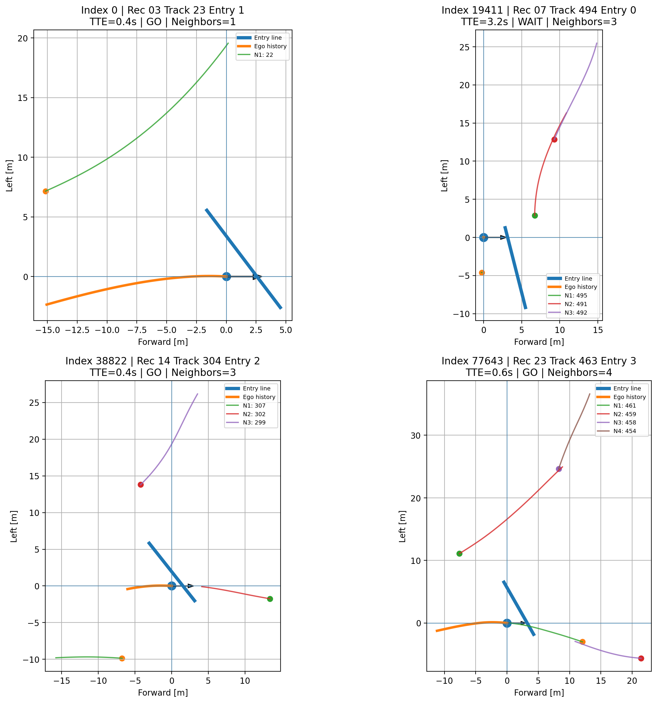
</p>

<p align="center">
  <em>Ego-centric 좌표계로 변환된 decision sample 예시</em>
</p>


## 4. Entry Line 정의 및 진입 이벤트 추출

rounD Dataset에는 차량의 연속적인 주행 궤적은 제공되지만,
차량이 정확히 어느 시점에 회전교차로에 진입했는지를 나타내는 label은 별도로 존재하지 않는다.

따라서 Location 0의 회전교차로에 대해 각 진입로별 **Entry Line**을 직접 정의하고,
차량 궤적이 해당 선을 통과하는 순간을 실제 진입 이벤트로 추출하였다.

### 4.1 Entry Line 정의

Location 0에는 총 4개의 진입로가 존재하며,
각 진입로에 Entry 0 ~ Entry 3을 시계방향으로 부여하였다.

<p align="center">
  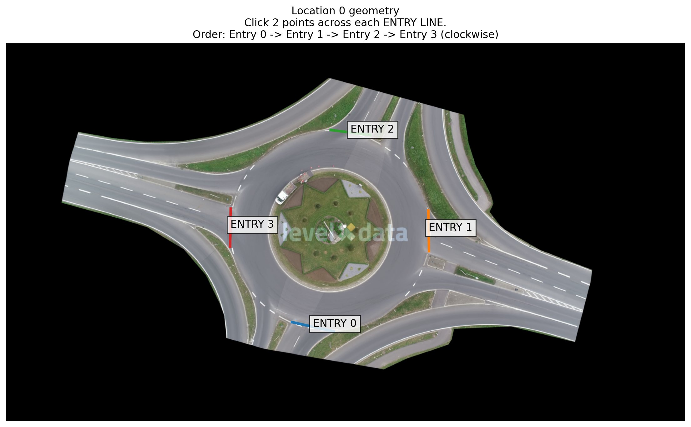
</p>

<p align="center">
  <em>rounD Location 0의 4개 Entry Line 정의</em>
</p>

이미지 좌표로 지정한 Entry Line은 rounD Dataset의 `orthoPxToMeter` 정보를 이용하여
실제 world coordinate로 변환하였다.

Location 0의 recording 02~23은 동일한 회전교차로와 좌표계를 공유하기 때문에
한 번 정의한 Entry geometry를 모든 recording에 공통으로 적용할 수 있었다.

---

### 4.2 Entry Crossing 검출

각 차량의 연속된 두 frame 사이의 궤적 segment와 Entry Line의 교차 여부를 검사하여
실제 crossing frame을 검출하였다.

단순히 선과 교차하는 경우만 사용하는 것이 아니라,
차량이 회전교차로 중심 방향으로 이동하는 경우만 진입 이벤트로 인정하여
반대 방향 이동이나 잘못된 crossing을 제거하였다.

<p align="center">
  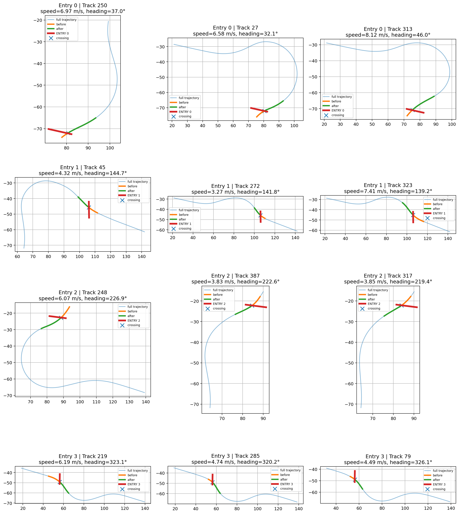
</p>

<p align="center">
  <em>Entry Line crossing 검출 결과 QA 예시</em>
</p>

그림에서 각 sample은 차량의 전체 궤적과 함께

- Entry Line
- 진입 직전 궤적
- 진입 직후 궤적
- 실제 crossing point

를 표시한다.

QA 결과 각 Entry에서 차량이 진입선을 통과하는 시점이 정상적으로 검출되는 것을 확인하였다.

---

### 4.3 추출 결과

Location 0의 recording 02~23에서 총 **11,354개의 진입 이벤트**를 추출하였다.

| Entry | 진입 이벤트 수 |
|---|---:|
| Entry 0 | 2,685 |
| Entry 1 | 2,657 |
| Entry 2 | 3,307 |
| Entry 3 | 2,705 |
| **Total** | **11,354** |

Ego 차량 후보는 다음 motor vehicle class를 대상으로 하였다.

```text
car
van
truck
bus
trailer
```

추출된 각 진입 이벤트에는 다음 정보가 포함된다.

```text
recordingId
trackId
entryId
crossingFrame
entrySpeed
entryHeading
```

이렇게 얻은 실제 진입 시점을 기준으로 이후 단계에서
차량이 진입하기 전 여러 시점의 **Time-to-Entry(TTE)**를 계산하고,
GO / WAIT decision sample을 생성하였다.

---

## 5. GO / WAIT Label 및 Decision Sample 생성

Entry Crossing 시점이 추출된 이후에는,
각 차량이 실제로 회전교차로에 진입하기 전 여러 시점에서
의사결정 sample을 생성하였다.

핵심 기준은 **Time-to-Entry(TTE)** 이다.

TTE는 현재 시점에서 실제 Entry Crossing 시점까지 남은 시간을 의미한다.

```text
TTE = Entry Crossing Time - Current Time
```

rounD Dataset의 frame rate가 25 Hz이므로,
frame 차이를 시간으로 변환하여 TTE를 계산하였다.

---

### 5.1 Decision Sample 생성 범위

각 진입 이벤트에 대해 진입 직전 구간에서 일정 간격으로 sample을 생성하였다.

```text
TTE 범위      : 0.4 s ~ 4.0 s
Sample 간격   : 0.2 s
History 길이  : 2.0 s
History frame : 50
```

즉, 하나의 차량 진입 이벤트에 대해
진입 4.0초 전부터 0.4초 전까지 여러 개의 decision sample을 생성하였다.

이 방식으로 총 다음과 같은 sample을 구성하였다.

| Split | Sample 수 |
|---|---:|
| Train | 77,644 |
| Validation | 16,751 |
| Test | 13,296 |
| **Total** | **107,691** |

---

### 5.2 GO / WAIT Label 정의

GO / WAIT label은 실제 차량이 얼마나 가까운 시점에 진입했는지를 기준으로 정의하였다.

최종적으로 다음 기준을 사용하였다.

```text
TTE <= 1.6 s  -> GO
TTE >  1.6 s  -> WAIT
```

즉,

- **GO**: 현재 상태에서 실제 진입까지 1.6초 이하가 남은 경우
- **WAIT**: 실제 진입까지 1.6초보다 더 많이 남은 경우

로 정의하였다.

이 기준을 사용한 결과 전체 dataset의 GO / WAIT 비율이 크게 치우치지 않았으며,
Train / Validation / Test에서 유사한 분포를 유지하였다.

| Split | GO 비율 |
|---|---:|
| Train | 46.85% |
| Validation | 48.71% |
| Test | 46.55% |

---

### 5.3 Label의 의미

본 프로젝트에서 사용하는 GO / WAIT label은
안전성이 수학적으로 최적화된 진입 판단 label이 아니다.

rounD Dataset에서 실제 운전자가 보여준 행동을 기준으로,

> "현재 시점으로부터 1.6초 이내에 실제로 진입했는가"

를 나타내는 **observational behavior label**로 사용하였다.

따라서 본 모델은 운전자의 실제 진입 행동 패턴을 학습하는 것을 목표로 한다.

---

### 5.4 Pre-entry Behavior 분석

진입 전 차량의 속도 변화를 확인한 결과,
차량은 진입 시점이 가까워질수록 평균적으로 속도가 증가하는 경향을 보였다.

| 진입까지 남은 시간 | 평균 속도 |
|---|---:|
| 5 s 전 | 2.43 m/s |
| 4 s 전 | 2.57 m/s |
| 3 s 전 | 2.93 m/s |
| 2 s 전 | 3.88 m/s |
| 1 s 전 | 4.92 m/s |
| Crossing | 5.97 m/s |

또한 일부 차량은 진입 전 거의 정지한 뒤 다시 출발하는 패턴을 보였다.

```text
0.5 m/s 이하로 0.5초 이상 정지 : 18.85%
0.5 m/s 이하로 1.0초 이상 정지 : 16.25%
```

이러한 결과를 통해 단순한 현재 속도만으로는
진입 행동을 충분히 설명하기 어렵고,
과거 수 초 동안의 시계열 정보를 함께 사용하는 것이 필요하다고 판단하였다.

---

## 6. Baseline 모델 구성 및 비교

시계열 기반 회전교차로 진입 예측에서 SSM 기반 모델의 성능을 확인하기 위해
단순 kinematic baseline, LSTM, Mamba2 모델을 순차적으로 구성하여 비교하였다.

모든 학습 모델은 동일한 입력 데이터와 동일한 multi-task 출력 구조를 사용하도록 구성하여
temporal encoder 자체의 차이를 비교할 수 있도록 하였다.

---

### 6.1 Kinematic Baseline

가장 단순한 기준 모델로 현재 차량의 속도와 진행 방향이 그대로 유지된다고 가정하였다.

즉, 현재 상태만을 이용하여 향후 움직임을 선형적으로 예측하는 방식이다.

이 baseline은 과거 시계열 정보나 주변 차량과의 interaction을 사용하지 않는다.

Test 결과는 다음과 같다.

| Metric | 결과 |
|---|---:|
| Accuracy | 90.68% |
| Precision | 0.9695 |
| Recall | 0.8258 |
| F1-score | 0.8919 |
| TTE MAE | 1.6351 s |
| Entry Speed MAE | 2.1481 m/s |
| Entry Heading MAE | 15.252° |

단순한 현재 상태만으로도 일정 수준의 GO / WAIT 분류는 가능했지만,
진입 시점과 속도, 각도 예측 오차는 상대적으로 크게 나타났다.

이를 통해 회전교차로 진입 행동을 예측하기 위해서는
현재 상태뿐 아니라 과거 주행 시계열을 함께 사용하는 것이 필요함을 확인하였다.

---

### 6.2 LSTM Baseline

시계열 정보를 학습하기 위한 첫 번째 deep learning baseline으로 LSTM을 사용하였다.

구조는 다음과 같이 구성하였다.

```text
Agent history
    ↓
Shared Frame Encoder
    ↓
2-layer LSTM
    ↓
Agent Feature
    ↓
Masked Mean / Max Pooling
    ↓
Entry Geometry Feature
    ↓
Scene Representation
    ↓
Multi-task Prediction Heads
```

주요 설정은 다음과 같다.

| 항목 | 값 |
|---|---:|
| Hidden dimension | 64 |
| LSTM layers | 2 |
| 입력 agent 수 | 최대 9 |
| History frames | 50 |
| Model parameters | 97,670 |

LSTM 모델은 다음 네 가지 출력을 동시에 예측하도록 구성하였다.

```text
GO / WAIT
Time-to-Entry
Entry Speed
Entry Heading
```

Test 결과는 다음과 같다.

| Metric | Full LSTM |
|---|---:|
| Accuracy | 99.61% |
| F1-score | 0.9958 |
| TTE MAE | 0.1165 s |
| Entry Speed MAE | 0.3773 m/s |
| Entry Heading MAE | 2.747° |

Kinematic baseline과 비교했을 때 모든 regression metric이 크게 개선되었으며,
과거 2초의 차량 움직임을 시계열로 학습하는 것이 효과적임을 확인하였다.

---

### 6.3 Ego + Map LSTM Ablation

주변 차량 정보의 기여도를 확인하기 위해
neighbor vehicle을 제거하고 Ego trajectory와 Entry geometry만 사용하는
ablation 모델을 추가로 학습하였다.

결과는 다음과 같다.

| Metric | Ego+Map LSTM | Full LSTM |
|---|---:|---:|
| F1-score | 0.9950 | 0.9958 |
| TTE MAE | 0.1234 s | 0.1165 s |
| Entry Speed MAE | 0.3929 m/s | 0.3773 m/s |
| Entry Heading MAE | 2.705° | 2.747° |

Full LSTM이 전반적으로 더 좋은 결과를 보였지만,
Ego+Map 모델과의 차이는 크지 않았다.

따라서 단순히 주변 차량의 raw trajectory를 함께 입력하는 것만으로는
회전교차로에서 중요한 차량 간 interaction이 충분히 강조되지 않을 가능성이 있다고 판단하였다.

이 결과를 바탕으로 이후 단계에서
회전교차로 내부 conflict vehicle을 명시적으로 찾고,
TTC와 temporal gap 정보를 추가로 분석하였다.

---

### 6.4 Mamba2 Baseline

SSM 기반 temporal encoder의 성능을 확인하기 위해
LSTM과 동일한 입력 및 pooling 구조에서 Mamba2 기반 모델을 구현하였다.

Mamba2 설정은 다음과 같다.

```text
d_model = 64
d_state = 64
d_conv  = 4
expand  = 2
layers  = 2
```

전체 model parameter 수는 약 108K이다.

구조는 다음과 같다.

```text
Agent history
    ↓
Feature Projection
    ↓
Mamba2 Block
    ↓
Residual Connection
    ↓
Mamba2 Block
    ↓
Temporal Feature
    ↓
Multi-agent Pooling
    ↓
Entry Geometry
    ↓
Scene Representation
    ↓
Multi-task Heads
```

Test 결과는 다음과 같다.

| Metric | Full LSTM | Mamba2 |
|---|---:|---:|
| F1-score | 0.9958 | **0.9968** |
| TTE MAE | 0.1165 s | **0.1058 s** |
| Entry Speed MAE | 0.3773 m/s | **0.3453 m/s** |
| Entry Heading MAE | 2.747° | **2.411°** |

Mamba2는 LSTM 대비 classification 및 regression 성능에서 전반적으로 더 좋은 결과를 보였다.

특히 TTE와 Entry Heading 예측에서 개선 폭이 확인되어,
회전교차로 진입 전 시계열 패턴을 표현하는 데 SSM 기반 구조가 효과적으로 동작함을 확인하였다.

---

## 7. 학습 성능 및 추론 효율 비교

LSTM과 Mamba2의 학습 과정 및 추론 성능을 추가로 비교하였다.

---

### 7.1 Validation 학습 곡선

LSTM과 Mamba2의 validation loss와 Time-to-Entry MAE를 비교하였다.

<p align="center">
  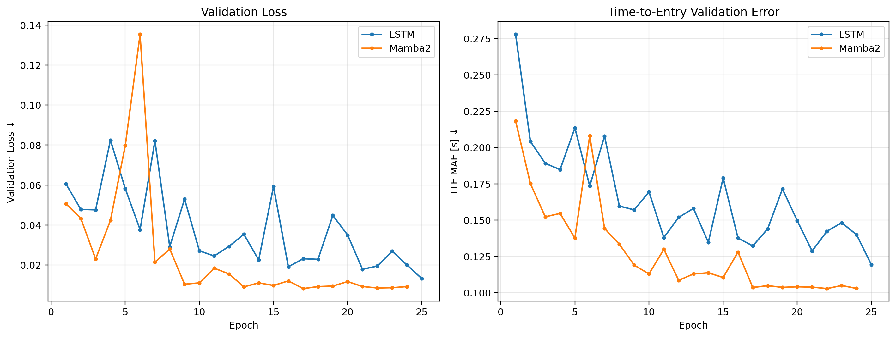
</p>

<p align="center">
  <em>LSTM과 Mamba2의 Validation Loss 및 TTE MAE 변화</em>
</p>

학습 초반에는 두 모델 모두 validation metric의 변동이 존재하였지만,
학습이 진행될수록 Mamba2의 TTE MAE가 더 낮은 수준으로 수렴하는 경향을 보였다.

최종 test 결과에서도 동일한 경향이 나타났다.

```text
Full LSTM TTE MAE : 0.1165 s
Mamba2 TTE MAE    : 0.1058 s
```

즉, 본 실험 환경에서는 Mamba2가 LSTM보다
회전교차로 진입 시점 예측에서 더 낮은 오차를 기록하였다.

---

### 7.2 추론 속도 및 메모리 사용량

정확도뿐 아니라 실제 추론 성능도 비교하였다.

비교 항목은 다음과 같다.

- Batch size 1 기준 단일 sample latency
- Batch size 128 기준 throughput
- Batch size 128 기준 peak VRAM

<p align="center">
  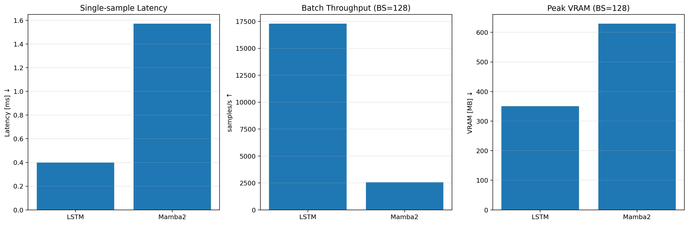
</p>

<p align="center">
  <em>LSTM과 Mamba2의 추론 latency, throughput, VRAM 비교</em>
</p>

측정 결과는 다음과 같다.

| 항목 | LSTM | Mamba2 |
|---|---:|---:|
| Parameters | 97,670 | 108,434 |
| BS=1 Latency | **0.399 ms** | 1.571 ms |
| BS=128 Throughput | **17,281 samples/s** | 2,567 samples/s |
| BS=128 Peak VRAM | **350.2 MB** | 629.0 MB |

현재 구현에서는 LSTM이 Mamba2보다 더 빠른 추론 속도와 낮은 메모리 사용량을 보였다.

이는 본 실험에서 Mamba2를 CUDA fused kernel이 아닌
**non-fused compatibility path**로 실행했기 때문이다.

```text
use_mem_eff_path = False
```

따라서 본 결과는 최적화된 Mamba2 구현의 일반적인 속도 특성을 의미하는 것은 아니며,
본 프로젝트에서 사용한 실제 실행 환경 기준의 측정 결과로 해석하였다.

결론적으로 본 실험에서는

- **예측 성능:** Mamba2가 우수
- **추론 속도 / 메모리 효율:** LSTM이 우수

한 결과를 보였다.

이후 단계에서는 단순한 temporal backbone 비교를 넘어,
회전교차로 내부 차량과의 interaction을 명시적으로 반영하기 위해
Conflict Point와 TTC 기반 feature를 추가하였다.

---

## 8. Conflict Point 및 Conflict Vehicle 분석

Ego+Map LSTM과 Full LSTM의 성능 차이가 크지 않았기 때문에,
단순히 주변 차량의 raw trajectory를 입력하는 것만으로는
회전교차로 진입에 중요한 interaction이 충분히 강조되지 않는다고 판단하였다.

따라서 회전교차로 내부 차량과 Ego 차량이 실제로 영향을 주고받는 지점을
**Conflict Point**로 정의하고,
현재 시점에서 해당 지점에 접근하는 circulating vehicle을 별도로 탐색하였다.

---

### 8.1 Conflict Point 추정

rounD Dataset에는 각 진입로의 정확한 물리적 conflict point가 별도로 제공되지 않는다.

따라서 본 프로젝트에서는 각 차량이 Entry Line을 통과한 뒤
약 **0.4초 후의 차량 위치**를 수집하고,
각 Entry별 대표 위치를 이용하여 data-driven conflict point를 구성하였다.

<p align="center">
  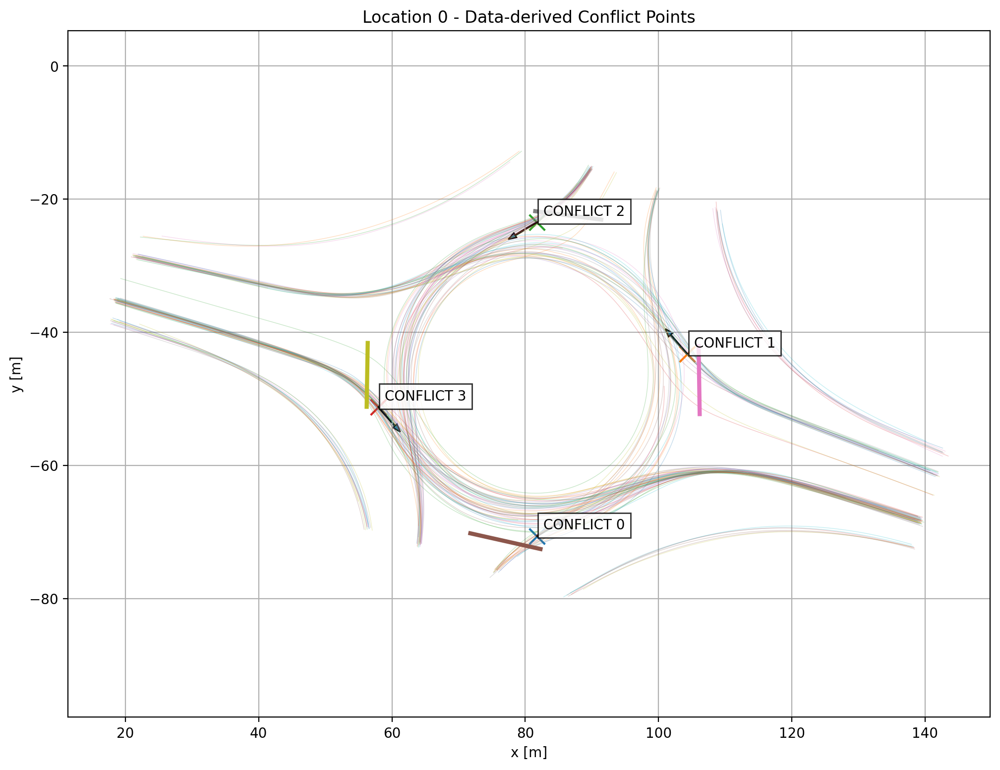
</p>

<p align="center">
  <em>Entry별 추정 Conflict Point와 회전교차로 진행 방향</em>
</p>

추정된 conflict geometry는 다음과 같다.

| Entry | Conflict Point (x, y) | Median Spread | 90% Spread |
|---|---|---:|---:|
| Entry 0 | (81.734, -70.616) | 0.84 m | 1.88 m |
| Entry 1 | (104.305, -43.256) | 0.80 m | 1.77 m |
| Entry 2 | (81.743, -23.462) | 0.82 m | 1.92 m |
| Entry 3 | (57.922, -51.225) | 0.76 m | 1.72 m |

각 Entry에서 crossing 이후의 차량 위치가 비교적 좁은 영역에 모이는 것을 확인하였으며,
이를 이후 conflict vehicle의 TTC 계산을 위한 대표 지점으로 사용하였다.

> 이 Conflict Point는 실제 도로 설계상의 정확한 충돌지점을 의미하는 것이 아니라,
> rounD 차량 궤적으로부터 추정한 **data-driven proxy**이다.

---

### 8.2 Conflict Vehicle 매칭

각 decision sample의 현재 frame에서
회전교차로 내부를 주행 중인 차량 가운데
Ego 차량의 진입과 가장 직접적인 interaction을 갖는 차량을 찾았다.

Conflict vehicle 후보는 다음 조건을 만족하도록 구성하였다.

```text
Roundabout ring 주변에 위치
Circulation tangent 방향과 진행방향이 정렬
최소 tangential speed >= 0.5 m/s
Conflict TTC <= 8 s
```

후보 차량 중 해당 Entry의 Conflict Point에 가장 먼저 도달할 것으로 추정되는 차량을
대표 conflict vehicle로 선택하였다.

중요한 점은 이 과정에서 **미래 trajectory를 사용하지 않고 현재 frame의 상태만 사용**했다는 것이다.

---

### 8.3 Conflict Vehicle 매칭 QA

추출된 conflict vehicle이 실제로 회전교차로 내부를 따라 이동하며
해당 Conflict Point 방향으로 접근하는지 시각적으로 검증하였다.

<p align="center">
  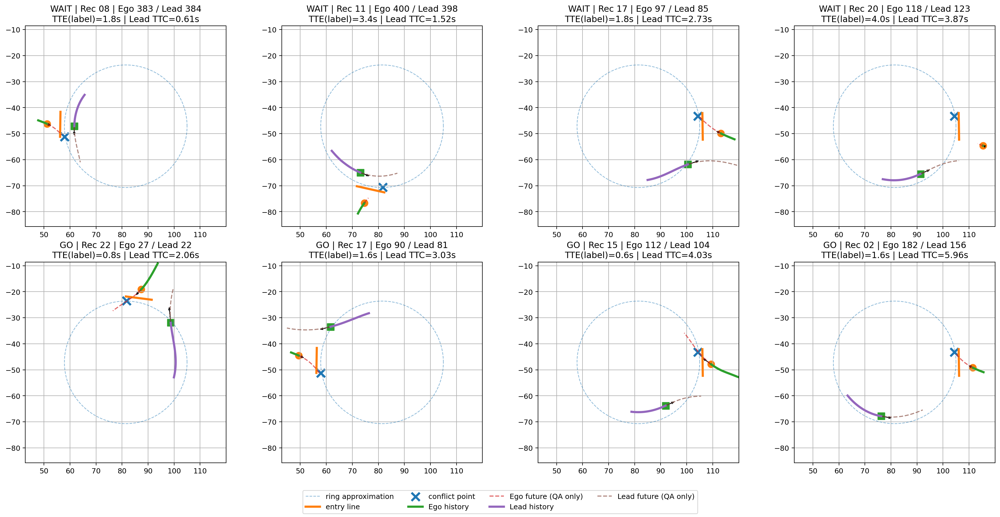
</p>

<p align="center">
  <em>현재 상태를 이용한 Conflict Vehicle 매칭 결과 예시</em>
</p>

각 그림에서는

- 주황색 궤적: Ego 차량
- 보라색 궤적: 선택된 Conflict Vehicle
- 빨간색 X: Conflict Point
- 화살표: 현재 차량 진행 방향

을 나타낸다.

QA 결과 선택된 차량이 회전교차로 내부를 따라 이동하며
예상 Conflict Point 방향으로 접근하는 것을 확인하였다.

---

### 8.4 Conflict Vehicle 통계

전체 107,691개의 decision sample 중
Conflict Vehicle이 매칭된 sample은 총 **74,203개**였다.

```text
전체 매칭률 : 68.90%
```

GO / WAIT 상황별 매칭률은 다음과 같다.

| Decision | Conflict Vehicle 존재 비율 |
|---|---:|
| WAIT | 74.89% |
| GO | 62.18% |

WAIT 상황에서 회전교차로 내부의 conflict vehicle이 존재하는 비율이
GO 상황보다 더 높게 나타났다.

또한 매칭된 차량의 Conflict TTC를 분석한 결과 다음과 같은 차이가 나타났다.

| Decision | Lead Conflict TTC Median |
|---|---:|
| WAIT | 2.18 s |
| GO | 3.42 s |

WAIT 상황에서는 circulating vehicle이 Conflict Point에 더 빠르게 접근하고 있었으며,
GO 상황에서는 상대적으로 더 큰 시간적 여유가 존재하였다.

이 결과를 바탕으로 다음 단계에서는
Ego와 Conflict Vehicle의 **TTC 및 temporal gap을 수치화하여 모델 입력 feature로 추가**하였다.

---

## 9. TTC / Temporal Gap 기반 Interaction Feature

Conflict Vehicle을 매칭한 이후에는
Ego 차량과 회전교차로 내부 차량의 상대적인 도착 관계를 수치화하였다.

단순히 주변 차량의 위치와 속도를 입력하는 것보다,
두 차량이 동일한 Conflict Point에 **언제 도달하는지**를 직접 표현하면
회전교차로 진입 interaction을 더 명확하게 나타낼 수 있다고 판단하였다.

---

### 9.1 Interaction Feature 구성

각 decision sample의 현재 시점에서
Ego 차량과 Conflict Vehicle의 상태를 이용하여 다음 feature를 계산하였다.

```text
egoDistToConflict
egoClosingSpeed
egoApproachAlignment
egoCvTTC

leadPresent
leadSpeed
leadArcDistance
leadConflictTTC

signedTTCGap
conflictOccupied
```

총 **10개의 interaction feature**를 최종 모델 입력으로 사용하였다.

각 feature의 의미는 다음과 같다.

| Feature | 의미 |
|---|---|
| egoDistToConflict | Ego와 Conflict Point 사이 거리 |
| egoClosingSpeed | Ego의 Conflict Point 방향 접근 속도 |
| egoApproachAlignment | Ego 진행 방향과 Conflict Point 접근 방향의 정렬 정도 |
| egoCvTTC | Ego가 현재 속도를 유지한다고 가정했을 때의 TTC |
| leadPresent | Conflict Vehicle 존재 여부 |
| leadSpeed | Conflict Vehicle 속도 |
| leadArcDistance | 회전교차로를 따라 Conflict Point까지 남은 거리 |
| leadConflictTTC | Conflict Vehicle의 Conflict Point 도달 예상 시간 |
| signedTTCGap | Lead TTC - Ego TTC |
| conflictOccupied | Conflict Point 주변에 차량이 존재하는지 여부 |

모든 feature는 **현재 frame에서 관측 가능한 정보와 고정된 geometry만을 사용하여 계산**하였다.

따라서 학습 label이나 미래 trajectory 정보는 interaction feature 생성에 사용하지 않았다.

---

### 9.2 Signed TTC Gap

가장 중요한 feature 중 하나로 다음 값을 사용하였다.

```text
signedTTCGap = Lead Conflict TTC - Ego TTC
```

값의 해석은 다음과 같다.

```text
signedTTCGap < 0
→ Conflict Vehicle이 Ego보다 먼저 Conflict Point에 도달할 가능성이 높음

signedTTCGap > 0
→ Ego가 Conflict Vehicle보다 먼저 Conflict Point에 도달할 시간적 여유가 존재
```

GO / WAIT sample을 비교한 결과 다음과 같은 차이가 나타났다.

| 항목 | WAIT | GO |
|---|---:|---:|
| Ego CV-TTC Median | 7.63 s | 1.91 s |
| Lead Conflict TTC Median | 2.18 s | 3.42 s |
| Signed TTC Gap Median | **-4.84 s** | **+1.67 s** |
| Conflict Occupancy | 20.28% | 10.15% |

특히 Signed TTC Gap은 WAIT와 GO에서 부호 자체가 다르게 나타났다.

WAIT 상황에서는 Conflict Vehicle이 Ego보다 먼저 Conflict Point에 도달하는 경우가 많았고,
GO 상황에서는 Ego가 먼저 진입할 수 있는 시간적 여유가 상대적으로 크게 나타났다.

이 결과를 통해 TTC / Gap 정보가
회전교차로 진입 행동과 뚜렷한 통계적 관계를 갖는 것을 확인하였다.

다만 이는 두 변수 사이의 **통계적 관계**를 나타내는 것이며,
TTC Gap이 운전자의 진입 판단을 직접적으로 발생시킨다는 인과관계를 의미하지는 않는다.

---

### 9.3 Interaction Feature 정규화

Interaction feature는 Train split의 통계량만을 사용하여 정규화하였다.

이를 통해 Validation / Test 정보가 학습 과정에 유입되지 않도록 하였다.

Conflict Vehicle이 존재하지 않는 sample의 경우에는
`leadPresent`를 제외한 lead vehicle 관련 feature를 중립값으로 처리하였다.

---

### 9.4 Naive Interaction Fusion

처음에는 기존 scene representation에 interaction feature를 직접 결합하는
일반적인 fusion 구조를 적용하였다.

```text
Trajectory Feature
        +
Interaction Feature
        ↓
   Feature Fusion
        ↓
Prediction Heads
```

하지만 결과는 오히려 기존 모델보다 일부 metric에서 성능이 감소하였다.

| Model | F1 | TTE MAE | Speed MAE | Heading MAE |
|---|---:|---:|---:|---:|
| Full LSTM | 0.9958 | 0.1165 s | 0.3773 m/s | 2.747° |
| Naive Interaction LSTM | 0.9952 | 0.1308 s | 0.4280 m/s | 2.885° |

Interaction 정보 자체는 GO / WAIT 상황에서 명확한 차이를 보였지만,
이를 기존 scene representation에 강하게 결합하는 방식은
이미 학습된 trajectory representation을 오히려 방해할 수 있다고 판단하였다.

---

### 9.5 Residual Interaction 방식

이를 해결하기 위해 interaction 정보를
기존 scene representation을 대체하는 정보가 아니라
**작은 보정값(residual correction)**으로 사용하였다.

구조는 다음과 같다.

```text
Base Scene Feature
        │
        ├──────────────────┐
        │                  │
        │        Interaction Features
        │                  │
        │        Interaction Encoder
        │                  │
        │              Correction
        │                  │
        └──── Base + α × Correction
                           │
                           ▼
                  Final Scene Feature
```

최종 scene feature는 다음 형태로 구성하였다.

```text
Final Feature
=
Base Feature
+
α × Interaction Correction
```

`α`는 학습 가능한 parameter이며,
초기값을 0으로 설정하여 기존 모델의 출력이 그대로 유지되도록 하였다.

즉, interaction 정보가 실제로 도움이 되는 경우에만
학습 과정에서 residual correction의 영향이 증가하도록 구성하였다.

---

### 9.6 Residual Interaction 결과

#### LSTM

| Model | F1 | TTE MAE | Speed MAE | Heading MAE |
|---|---:|---:|---:|---:|
| Full LSTM | 0.9958 | 0.1165 s | 0.3773 m/s | 2.747° |
| Residual Interaction LSTM | 0.9958 | **0.1136 s** | **0.3727 m/s** | **2.711°** |

기존 classification 성능을 유지하면서 regression metric이 소폭 개선되었다.

#### Mamba2

| Model | F1 | TTE MAE | Speed MAE | Heading MAE |
|---|---:|---:|---:|---:|
| Mamba2 Baseline | 0.9968 | 0.1058 s | 0.3453 m/s | 2.411° |
| Residual Interaction Mamba2 | **0.9971** | **0.1024 s** | 0.3456 m/s | **2.384°** |

Residual Interaction Mamba2는 Test set에서 다음 confusion matrix를 기록하였다.

| | Pred WAIT | Pred GO |
|---|---:|---:|
| True WAIT | 7,086 | 21 |
| True GO | 15 | 6,174 |

총 13,296개의 Test sample 중 오분류는 36개였다.

최종적으로 본 프로젝트에서는

> **raw multi-agent trajectory를 주요 정보로 사용하고,  
> TTC / Gap 기반 interaction 정보를 residual correction으로 보조하는 구조**

를 최종 interaction 모델로 선택하였다.

---

## 10. 미래 4초 주행 궤적 예측

진입 여부와 진입 시점만 예측하는 것에서 끝내지 않고,
실제 **주행계획(Driving Plan)**에 가까운 출력을 만들기 위해
향후 4초 동안의 미래 주행 궤적도 함께 예측하도록 모델을 확장하였다.

---

### 10.1 Future Trajectory Target 구성

각 decision sample의 현재 Ego pose를 기준으로
향후 4초 동안의 실제 차량 위치를 Ego-centric 좌표계로 변환하였다.

Trajectory target은 다음 조건으로 생성하였다.

```text
Prediction horizon : 4.0 s
Sampling interval  : 0.2 s
Future steps       : 20
Output shape       : [20, 2]
```

즉, 현재 시점 이후

```text
0.2 s
0.4 s
0.6 s
...
4.0 s
```

까지 총 20개의 미래 waypoint를 예측한다.

<p align="center">
  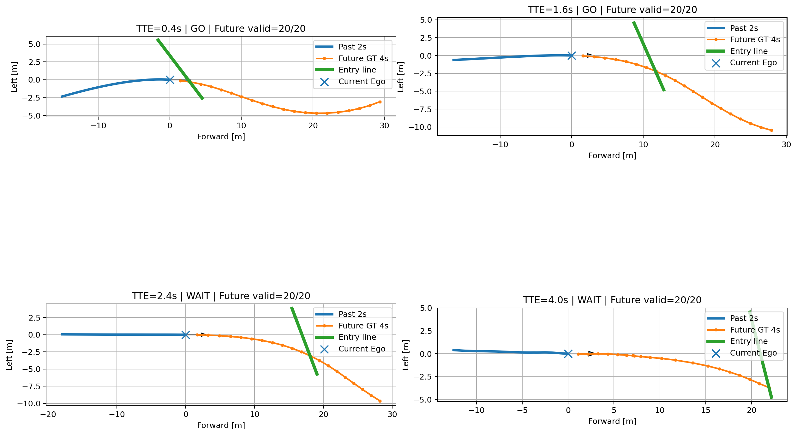
</p>

<p align="center">
  <em>과거 2초 Ego trajectory와 향후 4초 Ground Truth trajectory target 예시</em>
</p>

분석 결과 대부분의 sample에서 4초 future trajectory가 정상적으로 존재하였으며,
본 프로젝트의 TTE 범위인 0.4~4.0초 구간을 모두 포함할 수 있었다.

---

### 10.2 Trajectory Head 추가

기존 Residual Interaction Mamba2 모델의 scene representation에
별도의 trajectory prediction head를 추가하였다.

전체 구조는 다음과 같다.

```text
Ego / Neighbor History
        ↓
      Mamba2
        ↓
Multi-agent Scene Feature
        ↓
Residual Interaction Correction
        ↓
Final Scene Representation
        │
        ├── GO / WAIT
        ├── Time-to-Entry
        ├── Entry Speed
        ├── Entry Heading
        └── Future Trajectory [20 x 2]
```

Trajectory head는 최종 scene feature로부터
40개의 값을 출력한 뒤 `[20, 2]` 형태로 reshape하도록 구성하였다.

기존 모델의 decision 성능이 손상되지 않도록
trajectory 학습 단계에서는 기존 backbone과 prediction head를 고정하고,
trajectory head만 추가 학습하였다.

그 결과 기존 decision 성능은 그대로 유지되었다.

```text
Accuracy        : 99.73%
F1              : 0.9971
TTE MAE         : 0.1024 s
Entry Speed MAE : 0.3456 m/s
Entry Heading   : 2.384°
```

---

### 10.3 Trajectory 평가 지표

미래 궤적 예측 성능은 다음 두 지표를 사용하였다.

#### ADE (Average Displacement Error)

전체 미래 waypoint에서
예측 위치와 실제 위치 사이의 평균 Euclidean distance를 계산한다.

```text
ADE = 전체 미래 시점의 평균 위치 오차
```

#### FDE (Final Displacement Error)

마지막 미래 waypoint에서
예측 위치와 실제 위치 사이의 Euclidean distance를 계산한다.

```text
FDE = 마지막 시점의 위치 오차
```

본 프로젝트에서는 마지막 시점이 약 4초 후의 위치에 해당한다.

---

### 10.4 Constant Velocity Baseline

Trajectory prediction 성능을 비교하기 위해
현재 Ego 속도가 그대로 유지된다고 가정하는
Constant Velocity(CV) baseline을 구성하였다.

```text
x(t) = vx × t
y(t) = vy × t
```

즉, 차량이 현재 속도와 진행 방향을 유지한다고 가정하여
향후 4초의 위치를 계산하였다.

Test set 결과는 다음과 같다.

| Model | ADE ↓ | FDE ↓ |
|---|---:|---:|
| Constant Velocity | 3.5826 m | 9.1725 m |
| **Final Mamba2** | **0.7742 m** | **1.8905 m** |

<p align="center">
  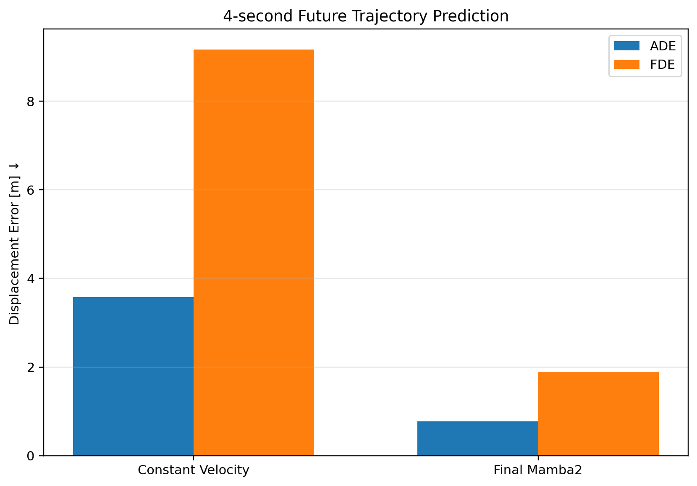
</p>

<p align="center">
  <em>Constant Velocity baseline과 Final Mamba2의 4초 미래 궤적 예측 오차 비교</em>
</p>

Constant Velocity baseline 대비 Final Mamba2의 오차 감소율은 다음과 같다.

```text
ADE reduction : 78.39%
FDE reduction : 79.39%
```

단순히 현재 속도를 유지하는 방식과 비교했을 때
회전교차로의 곡률과 진입 이후의 주행 방향을 학습한 모델이
미래 trajectory를 훨씬 정확하게 예측하는 것을 확인하였다.

---

### 10.5 Test Sample 예측 결과

최종 모델의 trajectory prediction을 실제 Test sample과 비교하였다.

<p align="center">
  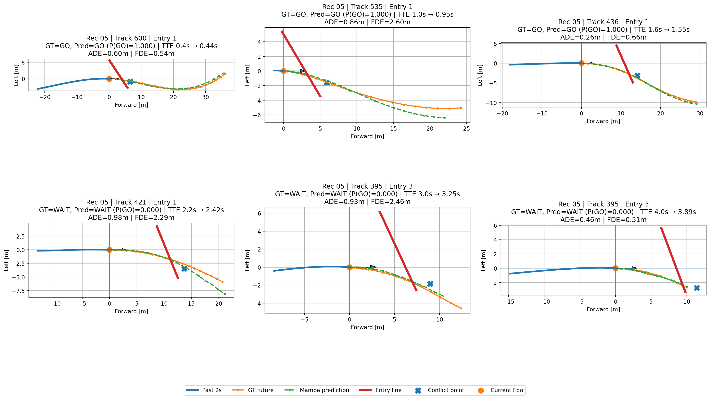
</p>

<p align="center">
  <em>Test set의 Ground Truth와 Final Mamba2 미래 궤적 예측 결과</em>
</p>

각 sample에는 다음 정보가 함께 표시된다.

- 과거 2초 Ego trajectory
- Ground Truth future trajectory
- Mamba2 predicted future trajectory
- Entry Line
- Conflict Point
- Ground Truth GO / WAIT
- Predicted GO / WAIT
- GO probability
- Ground Truth / Predicted TTE
- ADE
- FDE

TTE가 짧은 GO 상황부터
진입까지 시간이 많이 남은 WAIT 상황까지
다양한 sample에서 예측 trajectory가 실제 궤적을 전반적으로 따라가는 것을 확인하였다.

이를 통해 최종 모델이 단순한 진입 판단을 넘어
향후 차량의 실제 이동 방향까지 함께 예측할 수 있음을 확인하였다.

---

## 11. 최종 성능 비교 및 결과 정리

지금까지 구성한 Kinematic baseline, LSTM, Mamba2 및
Residual Interaction 기반 최종 모델의 성능을 비교하였다.

최종 평가는 recording-level split으로 분리된
**Test set 13,296 samples**를 기준으로 수행하였다.

---

### 11.1 전체 모델 성능 비교

| Model | F1 ↑ | TTE MAE ↓ | Speed MAE ↓ | Heading MAE ↓ |
|---|---:|---:|---:|---:|
| Kinematic | 0.8919 | 1.6351 s | 2.1481 m/s | 15.252° |
| Ego+Map LSTM | 0.9950 | 0.1234 s | 0.3929 m/s | 2.705° |
| Full LSTM | 0.9958 | 0.1165 s | 0.3773 m/s | 2.747° |
| Mamba2 Baseline | 0.9968 | 0.1058 s | **0.3453 m/s** | 2.411° |
| Residual Interaction LSTM | 0.9958 | 0.1136 s | 0.3727 m/s | 2.711° |
| **Final Mamba2** | **0.9971** | **0.1024 s** | 0.3456 m/s | **2.384°** |

<p align="center">
  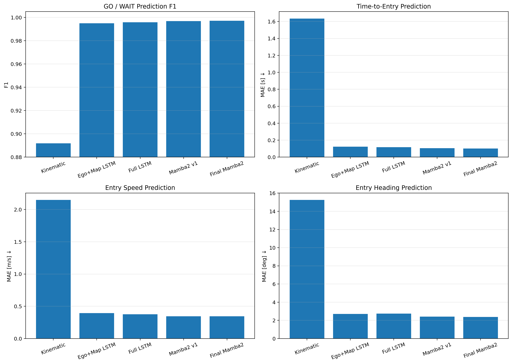
</p>

<p align="center">
  <em>Kinematic, LSTM, Mamba2 모델의 진입 판단 및 주행계획 예측 성능 비교</em>
</p>

Kinematic baseline과 비교했을 때
시계열 기반 LSTM과 Mamba2 모델은 모든 예측 항목에서 큰 성능 향상을 보였다.

또한 동일한 multi-agent 입력을 사용한 Full LSTM과 Mamba2를 비교했을 때
Mamba2가 전반적으로 더 낮은 regression error와 높은 F1-score를 기록하였다.

---

### 11.2 Full LSTM 대비 Final Mamba2

Full LSTM과 최종 Mamba2 모델의 성능을 직접 비교하면 다음과 같다.

```text
F1-score
0.9958 -> 0.9971

TTE MAE
0.1165 s -> 0.1024 s

Entry Speed MAE
0.3773 m/s -> 0.3456 m/s

Entry Heading MAE
2.747° -> 2.384°
```

오차 감소율은 다음과 같다.

| Metric | 감소율 |
|---|---:|
| TTE MAE | **12.10% 감소** |
| Entry Speed MAE | **8.40% 감소** |
| Entry Heading MAE | **13.21% 감소** |

이를 통해 본 실험에서는
Mamba2 기반 temporal encoder가 LSTM보다
회전교차로 진입 전의 시계열 패턴을 더 정확하게 표현하는 결과를 확인하였다.

---

### 11.3 Interaction 정보의 효과

Mamba2 Baseline과 Residual Interaction Mamba2를 비교하면 다음과 같다.

| Metric | Mamba2 Baseline | Final Mamba2 |
|---|---:|---:|
| F1-score | 0.9968 | **0.9971** |
| TTE MAE | 0.1058 s | **0.1024 s** |
| Entry Speed MAE | **0.3453 m/s** | 0.3456 m/s |
| Entry Heading MAE | 2.411° | **2.384°** |

Interaction feature를 추가했을 때
성능 변화 폭 자체는 크지 않았다.

이는 raw multi-agent trajectory가 이미 진입 행동과 관련된 대부분의 정보를 포함하고 있으며,
TTC와 temporal gap 정보는 이를 완전히 대체하기보다는
**추가적인 보정 정보로 활용되는 것이 적절함**을 의미한다.

실제로 naive interaction fusion은 성능을 저하시켰지만,
residual correction 방식에서는 기존 성능을 유지하면서
F1, TTE, Heading metric이 소폭 개선되었다.

---

### 11.4 최종 모델 출력

최종 모델은 하나의 입력으로부터 다음 5개의 결과를 동시에 예측한다.

```text
1. GO / WAIT
2. Time-to-Entry
3. Entry Speed
4. Entry Heading
5. Future Trajectory (4 s)
```

최종 Test 성능은 다음과 같다.

| 항목 | 결과 |
|---|---:|
| Accuracy | **99.73%** |
| F1-score | **0.9971** |
| TTE MAE | **0.1024 s** |
| Entry Speed MAE | **0.3456 m/s** |
| Entry Heading MAE | **2.384°** |
| Trajectory ADE | **0.7742 m** |
| Trajectory FDE | **1.8905 m** |

GO / WAIT classification의 confusion matrix는 다음과 같다.

| | Pred WAIT | Pred GO |
|---|---:|---:|
| True WAIT | 7,086 | 21 |
| True GO | 15 | 6,174 |

총 13,296개의 Test sample 중 36개가 오분류되었다.

---

### 11.5 최종 모델 구조 요약

```text
Ego + Neighbor Past Trajectory (2 s)
                │
                ▼
              Mamba2
                │
                ▼
       Multi-agent Representation
                │
                ├──────────────────────┐
                │                      │
                │              TTC / Temporal Gap
                │                      │
                │            Interaction Encoder
                │                      │
                └────── Residual Correction
                           │
                           ▼
                 Final Scene Feature
                           │
          ┌────────────────┼────────────────┐
          │                │                │
          ▼                ▼                ▼
       GO / WAIT          TTE          Entry Speed
                                             │
                           ┌─────────────────┴─────────────┐
                           ▼                               ▼
                    Entry Heading                 Future Trajectory
```

최종적으로 본 프로젝트에서는
**Mamba2 기반 시계열 표현을 중심으로 주변 차량의 interaction 정보를 residual 방식으로 보완하고,
진입 판단과 미래 주행 궤적을 동시에 예측하는 multi-task framework**를 구성하였다.

---

## 12. rounD Offline Replay 시연

최종 모델의 예측 결과를 실제 rounD 항공영상 위에서 확인하기 위해
offline replay visualization을 구성하였다.

Test recording의 실제 배경 이미지 위에 현재 주변 차량 상태와
Ego 차량의 과거 궤적, 미래 Ground Truth, Mamba2 예측 궤적을 함께 표시하였다.

<p align="center">
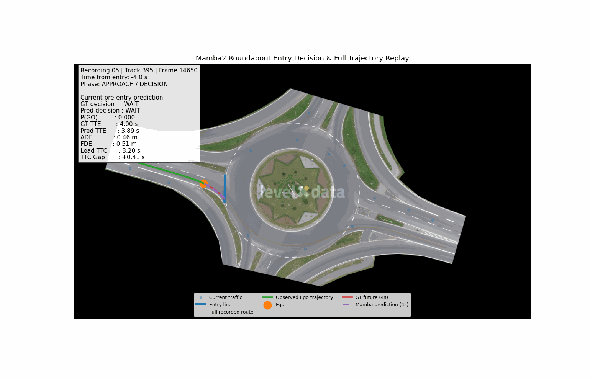
</p>

<p align="center">
  <em>rounD 실제 항공영상 위 Final Mamba2 예측 replay</em>
</p>

Replay에는 다음 정보가 함께 표시된다.

- 현재 주변 차량 위치
- Ego 차량 현재 위치
- Ego 과거 2초 궤적
- Ground Truth 미래 4초 궤적
- Final Mamba2 미래 4초 예측 궤적
- Entry Line
- Conflict Point
- Ground Truth GO / WAIT
- Predicted GO / WAIT
- GO probability
- Ground Truth / Predicted Time-to-Entry
- Lead Conflict Vehicle TTC
- Signed TTC Gap
- ADE / FDE

이 시각화를 통해 모델이 단순히 수치 결과만 출력하는 것이 아니라,
실제 회전교차로 환경에서

```text
현재 상태 인식
→ 진입 여부 판단
→ 진입 시점 예측
→ 향후 주행 방향 예측
```

의 흐름을 하나의 시스템으로 수행하는 것을 확인할 수 있다.

---

### 12.1 Replay 예시 해석

위 예시에서는 Ego 차량이 회전교차로 진입로에 접근하면서
시간이 지남에 따라 WAIT 상태에서 GO 상태로 전환되는 과정을 확인할 수 있다.

각 frame에서 모델은 과거 2초 동안의 차량 움직임과
현재 Conflict Vehicle 정보를 입력으로 사용하여
진입 의사결정과 향후 4초의 주행 궤적을 동시에 예측한다.

Predicted trajectory는 실제 Ground Truth trajectory와 유사한 곡률을 따라가며,
회전교차로 진입 이후의 진행 방향까지 예측하는 모습을 확인할 수 있다.

---

### 12.2 최종 시연 목적

본 Replay는 실시간 closed-loop autonomous driving system을 구현한 것은 아니다.

rounD Dataset에 기록된 실제 교통상황을 기반으로
최종 모델의 예측 결과를 시각적으로 검증하기 위한
**offline prediction demo**로 구성하였다.

따라서 본 프로젝트의 최종 범위는 다음과 같다.

```text
Real-world recorded trajectory
        ↓
Offline model inference
        ↓
Entry decision prediction
        ↓
Driving plan prediction
        ↓
Visualization
```

CARLA나 실제 차량 제어를 포함하지 않고,
rounD Dataset 기반의 회전교차로 진입 판단 및 주행계획 예측 모델 개발과 검증에 초점을 맞추었다.

---

## 13. 소스코드

프로젝트 구현 코드는 기능별로 다음과 같이 구성하였다.

```text
Roundabout-SSM/
├── configs/      # Geometry, split, normalization 설정
├── dataset/      # Dataset 및 입력 데이터 구성
├── models/       # LSTM / Mamba2 모델
├── scripts/      # 전처리, 분석, 평가, 시각화
├── train/        # 모델 학습 코드
└── images/       # 결과 이미지 및 Replay GIF
```

주요 구현 파일:

- [Mamba2 baseline](models/mamba_baseline.py)
- [Residual Interaction Mamba2](models/mamba_residual_interaction.py)
- [Final Mamba2 + Trajectory Head](models/mamba_trajectory.py)
- [Interaction Dataset](dataset/interaction_dataset.py)
- [Future Trajectory Dataset](dataset/trajectory_dataset.py)
- [Mamba2 학습 코드](train/train_mamba.py)
- [Final Trajectory 학습 코드](train/train_mamba_trajectory.py)
- [Conflict Vehicle 매칭](scripts/24_match_conflict_vehicles.py)
- [Interaction Feature 계산](scripts/26_compute_interaction_features.py)
- [최종 예측 시각화](scripts/40_visualize_final_predictions.py)
- [rounD Replay 생성](scripts/41_make_round_replay.py)

---

## Reference

R. Krajewski, T. Moers, J. Bock, L. Vater, and L. Eckstein,  
**"The rounD Dataset: A Drone Dataset of Road User Trajectories at Roundabouts in Germany,"**  
2020 IEEE 23rd International Conference on Intelligent Transportation Systems (ITSC), pp. 1–6, 2020.  
DOI: 10.1109/ITSC45102.2020.9294728

---

## Dataset

- **rounD Dataset**
- Provider: RWTH Aachen University, Institute for Automotive Engineering (ika)
- Official Page: https://levelxdata.com/round-dataset/
- Paper: *The rounD Dataset: A Drone Dataset of Road User Trajectories at Roundabouts in Germany*
- Authors: R. Krajewski, T. Moers, J. Bock, L. Vater, L. Eckstein
- Conference: IEEE ITSC 2020
- DOI: 10.1109/ITSC45102.2020.9294728
